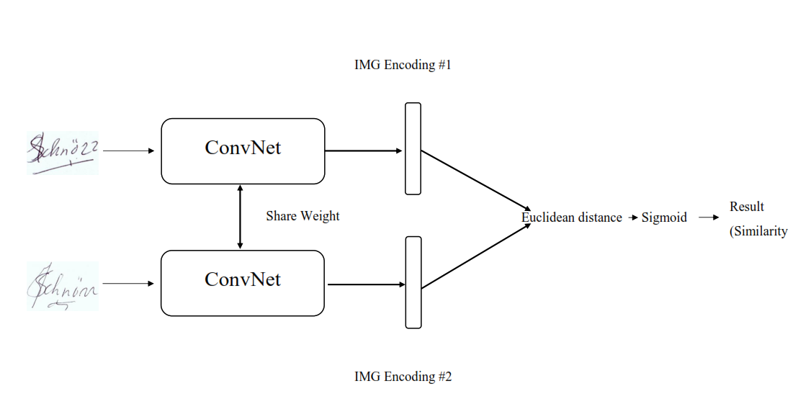

# Siamese-Network-Signature-Classification
## Pendahuluan
Siamese Network adalah jaringan saraf tiruan yang menggunakan bobot yang sama saat bekerja bersama-sama pada dua vektor input yang berbeda untuk menghitung vektor output yang sebanding. Seringkali salah satu vektor keluaran dikomputasi sebelumnya, sehingga membentuk garis dasar yang dengannya vektor keluaran lainnya dibandingkan

 

     

 

Siamese Networks dapat diterapkan pada kasus penggunaan yang berbeda, seperti mendeteksi duplikat, menemukan anomali, dan pengenalan wajah.
Contoh ini menggunakan Siamese Network dengan tiga subnetwork yang identik. Kami akan memberikan tiga gambar ke model, di mana dua di antaranya akan serupa (jangkar dan sampel positif), dan yang ketiga tidak terkait (contoh negatif.) Tujuan kami adalah agar model belajar memperkirakan kesamaan antara gambar.

 

## Tools yang digunakan

* Python 3
* PyTorch
- Pandas
- Matplotlib
- Image

## Dataset

- kaggle
https://www.kaggle.com/datasets/robinreni/signature-verification-dataset

